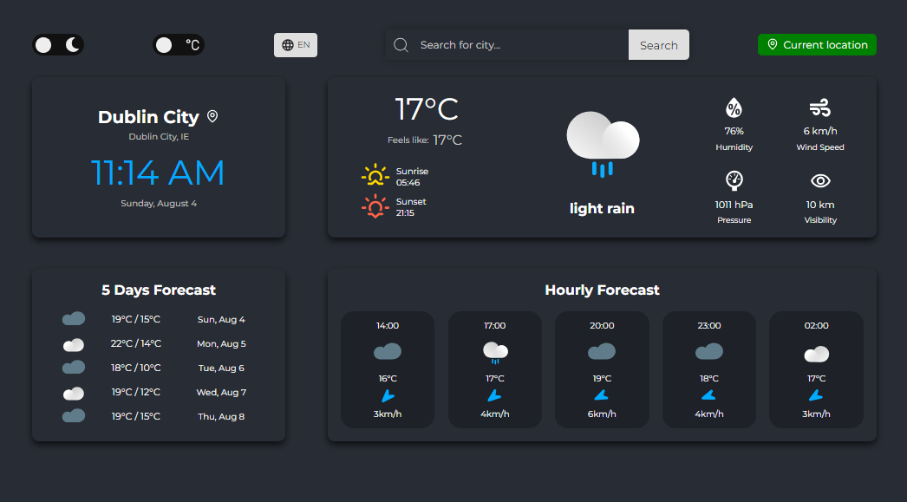

Welcome to my Weather App project. This React-based application provides real-time weather information and forecasts with an intuitive user interface. Below you'll find a detailed description of the app's features and how to set it up on your local machine.

## Table of Contents

- [Project Overview](#project-overview)
- Features
  - [Current Weather Information](#current-weather-information)
  - Forecast
  - [Location Search](#location-search)
  - [Theme and Units](#theme-and-units)
  - [Multi-language Support](#multi-language-support)
  - [Responsive Design](#responsive-design)
- [Technology Stack](#technology-stack)
- Installation
- Usage
- [Error Handling](#error-handling)
- Contributing
- License
- Contact

## Project Overview



This Weather App is designed to provide users with comprehensive weather information for any location worldwide. It combines data from multiple APIs to offer accurate and detailed weather forecasts.

## Features

### Current Weather Information

- Displays temperature, feels-like temperature, sky condition image/description, and sunrise/sunset times in local time.
- Shows local searched city time and data.
- Provides humidity, wind speed, pressure, and visibility information.

### Forecast

- **5-Day Forecast**:
  - Shows max/min temperatures, day names, and dates.
- **18-Hour Forecast**:
  - Provides 3-hour interval forecasts.
  - Displays time, sky condition image, temperature, wind direction, and speed.

### Location Search

- Utilizes Google Maps API for accurate city search.
- Offers city suggestions when the user types more than 2 letters.
- Displays full location information (city, state, country).
- Shows "location" icon beside city name when 'Current location' is requested to fetch weather data.

### Theme and Units

- Toggle to switch between dark (default) and light themes.
- Temperature unit toggle between Celsius (default) and Fahrenheit (temperature units are converted locally to prevent unnecessary API requests).

### Multi-language Support

- Interface available in 7 languages: English (default), Spanish, French, German, Italian, Polish, and Portuguese.
- Uses i18next for translations and react-world-flags for country flags.

### Responsive Design

- Fully responsive on all devices.
- Mobile-optimized interface (e.g., search button hidden on mobile devices).

## Technology Stack

- React
- TypeScript
- Styled-components
- Jest (for unit testing)
- i18next
- react-icons
- react-spinners
- react-world-flags
- Google Maps API
- OpenWeatherMap API

## Installation

### Prerequisites

- Ensure you have Node.js and npm installed on your machine.

### Steps

1. **Clone the Repository**:

   ```shell
   git clone https://github.com/radek-drw/weather-app.git
   cd weather-app
   ```

2. **Install Dependencies**:

   ```shell
   npm install
   ```

3. **Set Up Environment Variables**:

   Create a [`.env`](command:_github.copilot.openRelativePath?%5B%7B%22scheme%22%3A%22file%22%2C%22authority%22%3A%22%22%2C%22path%22%3A%22%2Fc%3A%2FUsers%2FMadziunia%20Radunio%2FDesktop%2Fweather-app%2F.env%22%2C%22query%22%3A%22%22%2C%22fragment%22%3A%22%22%7D%5D "c:\\Users\Madziunia Radunio\Desktop\weather-app.env") file in the root directory and add your API keys:

   ```env
   REACT_APP_GOOGLE_MAPS_API_KEY=your_google_maps_api_key
   REACT_APP_OPENWEATHERMAP_API_KEY=your_openweathermap_api_key
   ```

4. **Start the Development Server**:

   ```shell
   npm start
   ```

   This will start the development server and open the website in your default browser.

5. **Build for Production**:

   ```shell
   npm run build
   ```

   This will create an optimized production build in the [`build`](command:_github.copilot.openRelativePath?%5B%7B%22scheme%22%3A%22file%22%2C%22authority%22%3A%22%22%2C%22path%22%3A%22%2Fc%3A%2FUsers%2FMadziunia%20Radunio%2FDesktop%2Fweather-app%2Fbuild%22%2C%22query%22%3A%22%22%2C%22fragment%22%3A%22%22%7D%5D "c:\\Users\Madziunia Radunio\Desktop\weather-app\build") folder.

## Error Handling

The app includes comprehensive error handling for various scenarios:

- Invalid input characters (less than 2 or more than 50 characters).
- City not found.
- Geolocation not supported or denied by the user.
- API fetch failures (forecast data, weather data).
- Toast notifications for user feedback.

## Contributing

If you would like to contribute to this project, please fork the repository and use a feature branch. Pull requests are warmly welcome.

## License

This project is open source and available under the MIT License.

## Contact

If you have any questions or feedback, feel free to contact me at [rdrweski@gmail.com].
